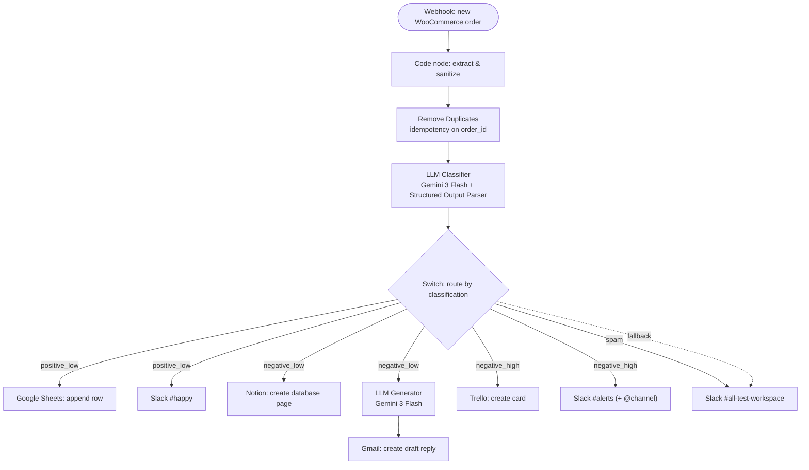

# WooCommerce AI Support Agent v1

🌐 **English** · [Українська](README.ua.md) · [Русский](README.ru.md)

An n8n workflow that triages incoming WooCommerce order notes with an LLM and routes each one to Slack, Notion, Gmail, Google Sheets, or Trello based on sentiment, category, and urgency. Built as Mini-project #4 (flagship) of an AI-automation training track.

📹 **[Watch the 1:30-minute demo on Loom →](https://www.loom.com/share/e67103f7ac5a4edebde10104a9c0e505)**

---

## Architecture

---

## What it does

When a customer leaves a note on a WooCommerce order, the store owner usually has to read it, judge how serious it is, and decide who should handle it. This workflow automates that first pass:

1. A new order fires a webhook into n8n.
2. The note is cleaned and key order fields are extracted.
3. An LLM classifies the note (sentiment / category / urgency) and returns **structured JSON**.
4. A Switch routes the order down one of four branches, each with its own actions.

The human stays in the loop where it matters: negative replies are prepared as **Gmail drafts**, never auto-sent.

## Pipeline

| Node | Type | Role |
|------|------|------|
| `Webhook_React on new woocommerce order` | Webhook (POST) | Receives the order. Object lives under `body`. |
| `JS code_extract & sanitize` | Code (JavaScript) | Flattens the order, strips HTML from the note, exposes `order_id`, `email`, `note_clean`, etc. |
| `Remove Duplicates` | Remove Duplicates | Idempotency on `order_id` — a re-delivered webhook can't double-process an order. |
| `Basic LLM Chain_Classifier` | LLM (Gemini 3 Flash) | Classifies the note. Parser enforces strict JSON. |
| `Switch` | Switch (Rules) | Routes on `output.classification` + a Fallback safety output. |

## Routing

| Branch | Trigger | Actions |
|--------|---------|---------|
| **positive_low** | Praise, thanks, neutral notes | Google Sheets row · Slack `#happy` |
| **negative_low** | Mild / non-urgent complaint | Notion page · reply generated by a second LLM → Gmail **draft** |
| **negative_high** | Urgent: refund, damage, anger | Trello card · Slack `#alerts` with `@channel` |
| **spam** | Ads, gibberish | Log to Slack `#all-test-workspace` |
| **fallback** | Anything outside the four classes | Log to Slack `#all-test-workspace` |

## Prompts

Both LLM steps use externalized prompts (in [`prompts/`](prompts/)) so they can be reviewed and tuned without touching the workflow:

- **[Classifier prompt](prompts/Basic%20LLM%20Chain%20_%20Classifier)** — turns a raw note into strict `sentiment` / `category` / `urgency` JSON for routing.
- **[Reply-generator prompt](prompts/Basic%20LLM%20Chain_Create%20reply%20for%20cx)** — drafts an empathetic customer reply; explicitly instructed **not** to promise refunds or compensation (a human decides that).

## Reliability

- **Retry on fail** — on all external-call nodes (both LLMs, Slack, Notion, Gmail, Sheets, Trello).
- **Idempotency** — `Remove Duplicates` on `order_id`.
- **Error workflow** — a separate workflow reports failures to Slack.
- **Pin Data** — the webhook output is pinned for reproducible demos.

## Testing

| Expected branch | Sample note |
|-----------------|-------------|
| positive_low | "Thank you so much! Super fast delivery and the product is perfect." |
| negative_low | "A bit disappointed — the item arrived with a scratch. Not urgent, but I expected better." |
| negative_high | "Unacceptable — my order arrived broken for the SECOND time. I want a full refund immediately!" |
| spam | "🔥 BUY CHEAP REPLICA WATCHES NOW!!! 90% OFF, click here!!!" |

## Demo

Each branch produces a live action on a real service:

**negative_high → Slack `#alerts` + Trello card**

**negative_low → Notion page + Gmail draft**

**positive_low → Slack `#happy` + Google Sheets row**

**spam → Slack log**

## Tech stack

n8n (self-hosted, Docker) · WooCommerce (LocalWP) · Google Gemini (Gemini 3 Flash) · Slack · Notion · Gmail · Google Sheets · Trello

## Credentials required

| Service | Credential type in n8n | Notes |
|---------|------------------------|-------|
| Google Gemini | Google Gemini (API key) | Used by both LLM chains |
| Slack | Slack API (Bot token, `xoxb-…`) | Scopes: `chat:write`, `chat:write.public` |
| Google (Sheets + Gmail) | Google OAuth2 | One credential covers both |
| Notion | Notion API (integration token) | Share the integration with the target database |
| Trello | Trello API (key + user token) | Key tied to a Power-Up; add n8n URL to Allowed Origins |

## Setup

1. Import `workflow.json` into n8n.
2. Recreate the credentials above (import carries references, not secrets).
3. Register the WooCommerce webhook → Delivery URL = your n8n production URL (`/webhook/…`), workflow **Published**.
4. Point the Sheets, Notion, and Trello nodes at your own sheet / database / list IDs.

---

## Author

**Igor Gorshkov** — former support chat agent at Crocoblock, now transitioning into AI Automation. This project is part of my portfolio.
