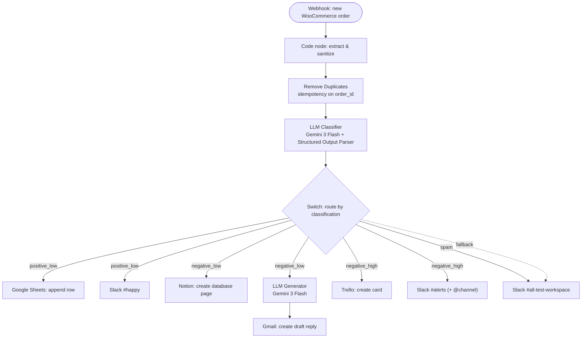

# WooCommerce AI Support Agent v1

🌐 [English](README.md) · **Українська** · [Русский](README.ru.md)

Воркфлоу n8n, що сортує нотатки до замовлень WooCommerce за допомогою LLM і спрямовує кожну до Slack, Notion, Gmail, Google Sheets чи Trello — залежно від тональності, категорії та терміновості. Створено як Mini-project #4 (флагман) навчального треку з AI-автоматизації.

📹 **[Подивитись 1:30-хвилинне демо на Loom →](https://www.loom.com/share/e67103f7ac5a4edebde10104a9c0e505)**

---

## Архітектура

---

## Що це

Коли клієнт залишає нотатку до замовлення WooCommerce, власник магазину зазвичай має прочитати її, оцінити серйозність і вирішити, хто має відповісти. Цей воркфлоу автоматизує перший прохід:

1. Нове замовлення надсилає вебхук у n8n.
2. Нотатка очищується, з замовлення витягуються ключові поля.
3. LLM класифікує нотатку (тональність / категорія / терміновість) і повертає **структурований JSON**.
4. Switch спрямовує замовлення в одну з чотирьох гілок зі своїми діями.

Людина лишається в контурі там, де це важливо: відповіді на негатив готуються як **чернетки Gmail** і ніколи не надсилаються автоматично.

## Пайплайн

| Нода | Тип | Роль |
|------|-----|------|
| `Webhook_React on new woocommerce order` | Webhook (POST) | Приймає замовлення. Об'єкт лежить під `body`. |
| `JS code_extract & sanitize` | Code (JavaScript) | Розгортає замовлення, чистить нотатку від HTML, віддає `order_id`, `email`, `note_clean` тощо. |
| `Remove Duplicates` | Remove Duplicates | Ідемпотентність за `order_id` — повторна доставка вебхука не обробляється двічі. |
| `Basic LLM Chain_Classifier` | LLM (Gemini 3 Flash) | Класифікує нотатку. Парсер задає суворий JSON. |
| `Switch` | Switch (Rules) | Маршрутизація за `output.classification` + запасний вихід Fallback. |

## Маршрутизація

| Гілка | Тригер | Дії |
|-------|--------|-----|
| **positive_low** | Подяка, похвала, нейтральні нотатки | Рядок у Google Sheets · Slack `#happy` |
| **negative_low** | М'яка/нетермінова скарга | Сторінка в Notion · генерація відповіді другим LLM → **чернетка** Gmail |
| **negative_high** | Термінове: повернення коштів, пошкодження, гнів | Картка в Trello · Slack `#alerts` з `@channel` |
| **spam** | Реклама, беззмістовний текст | Лог у Slack `#all-test-workspace` |
| **fallback** | Будь-що поза чотирма класами | Лог у Slack `#all-test-workspace` |

## Промпти

Обидва LLM-кроки використовують винесені промпти (у теці [`prompts/`](prompts/)), щоб їх можна було переглядати й налаштовувати без зміни воркфлоу:

- **[Промпт класифікатора](prompts/Basic%20LLM%20Chain%20_%20Classifier)** — перетворює нотатку на суворий JSON `sentiment` / `category` / `urgency` для маршрутизації.
- **[Промпт генератора відповіді](prompts/Basic%20LLM%20Chain_Create%20reply%20for%20cx)** — готує емпатичну відповідь клієнту; явно проінструктований **не** обіцяти повернення коштів чи компенсацію (це вирішує людина).

## Надійність

- **Retry on fail** — на всіх нодах із зовнішніми викликами (обидва LLM, Slack, Notion, Gmail, Sheets, Trello).
- **Ідемпотентність** — `Remove Duplicates` за `order_id`.
- **Error workflow** — окремий воркфлоу сповіщає про збої у Slack.
- **Pin Data** — вихід вебхука закріплено для відтворюваного демо.

## Тестування

| Очікувана гілка | Приклад нотатки |
|-----------------|-----------------|
| positive_low | "Thank you so much! Super fast delivery and the product is perfect." |
| negative_low | "A bit disappointed — the item arrived with a scratch. Not urgent, but I expected better." |
| negative_high | "Unacceptable — my order arrived broken for the SECOND time. I want a full refund immediately!" |
| spam | "🔥 BUY CHEAP REPLICA WATCHES NOW!!! 90% OFF, click here!!!" |

## Демонстрація

Кожна гілка виконує живу дію в реальному сервісі:

**negative_high → Slack `#alerts` + картка Trello**

**negative_low → сторінка Notion + чернетка Gmail**

**positive_low → Slack `#happy` + рядок Google Sheets**

**spam → лог у Slack**

## Технології

n8n (self-hosted, Docker) · WooCommerce (LocalWP) · Google Gemini (Gemini 3 Flash) · Slack · Notion · Gmail · Google Sheets · Trello

## Потрібні креденшели

| Сервіс | Тип креденшелу в n8n | Примітки |
|--------|----------------------|----------|
| Google Gemini | Google Gemini (API key) | Використовується обома LLM-ланцюгами |
| Slack | Slack API (Bot token, `xoxb-…`) | Скоупи: `chat:write`, `chat:write.public` |
| Google (Sheets + Gmail) | Google OAuth2 | Один креденшел покриває обидва |
| Notion | Notion API (integration token) | Поділіться інтеграцією з цільовою базою |
| Trello | Trello API (key + user token) | Ключ прив'язаний до Power-Up; додайте URL n8n в Allowed Origins |

## Налаштування

1. Імпортуйте `workflow.json` у n8n.
2. Відтворіть креденшели вище (імпорт переносить посилання, не секрети).
3. Зареєструйте вебхук WooCommerce → Delivery URL = ваш production-URL n8n (`/webhook/…`), воркфлоу **Published**.
4. Вкажіть у нодах Sheets, Notion і Trello власні ID таблиці / бази / списку.

---

## Автор

**Ігор Горшков** — колишній агент чат-підтримки Crocoblock, зараз переходжу в AI Automation. Ця робота — частина мого портфоліо.
